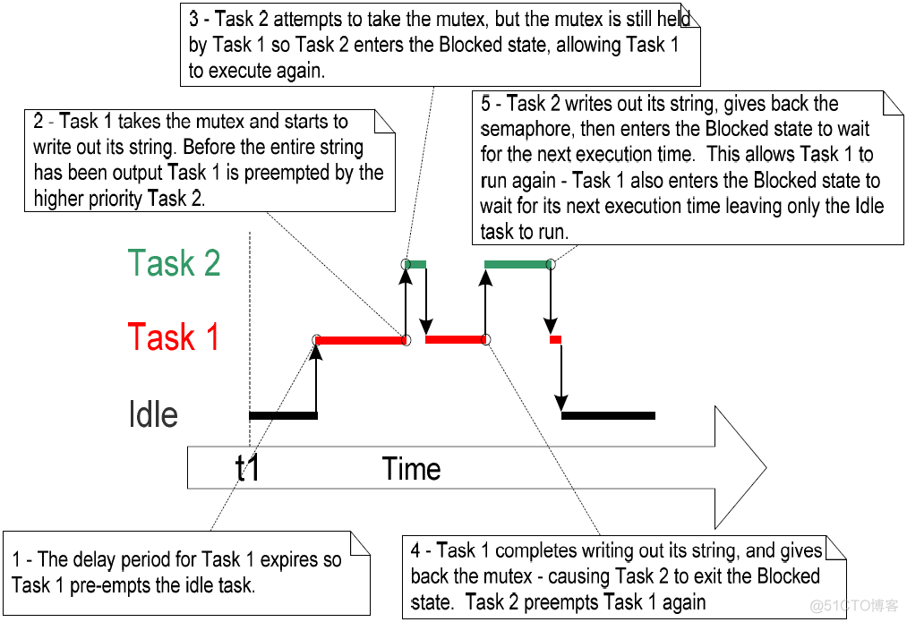

## 问题由来​

日常调试过程中，printf调试信息输出是一项非常重要的调试手段，尤其是对于不能在线调试的MCU来说，printf几乎成了必备的调试手段。

在使用rtos时，你是否遇到过因为打印调试信息引起程序异常的情况，或者是打印信息完全“放飞自我”，不按照自己的设计输出，从printf打印异常出发，学习一下rtos中的资源管理。

## 现象

实验很简单，创建两个任务，分别打印不同的内容，从结果来看，显然是有问题的，一个任务把另一个截断了，导致输出混乱。


## ​问题分析​

多任务系统中存在一种潜在的风险。当一个任务在使用某个资源的过程中，即还没 有完全结束对资源的访问时，便被切出运行态，使得资源处于非一致，不完整的状态。如果这个时候有另一个任务或者中断来访问这个资源，则会导致数据损坏或是其它相似 的错误。

FreeRTOS指南中给出这样一个例子，与printf的现象几乎是一样的：

### 1. 访问外设

考虑如下情形，有两个任务都试图往一个 LCD 中写数据：

- 任务 A 运行，并往 LCD 写字符串”Hello world”。
- 任务 A 被任务 B 抢占，但此时字符串才输出到”Hello w”。
- 任务 B 往 LCD 写”Abort, Retry, Fail?”，然后进入阻塞态。
- 任务 A 从被抢占处继续执行，完成剩余的字符输出——“orld”。现在 LCD 显示的是被破坏了的字符串”Hello wAbort, Retry, Fail?orld”。

### 2. 读-改-写操作

程序清单 57 展现的是一段 C 代码和其等效的 ARM7 汇编代码。可以看出， PORTA 中的值先从内存读到寄存器，在寄存器中完成修改，然后再写回内存。这所是所谓的读 -改-写操作。

这是一个”非原子”操作，因为完成整个操作需要不止一条指令，所以操作过程可能 被中断。考虑如下情形，两个任务都试图更新一个名为 PORTA 的内存映射寄存器：

- 任务 A 把 PORTA 的值加载到寄存器中——整个流程的读操作。
- 在任务 A 完成整个流程的改和写操作之前，被任务 B 抢占。
- 任务 B 完整的执行了对 PORTA 的更新流程，然后进入阻塞态。
- 任务 A 从被抢占处继续执行。其修改了一个 PORTA 的拷贝，这其实只是寄存器在任务 A 回写到 PORTA 之前曾经保存过的值。

任务 A 更新并回写了一个过期的 PORTA 寄存器值。在任务 A 获得拷贝与更新回 写之间，任务 B 又修改了 PORTA 的值。而之后任务 A 对 PORTA 的回写操作，覆盖 了任务 B 对 PORTA 进行的修改结果，效果上等同于破坏了 PORTA 寄存器的值。

虽然是以一个外围设备寄存器为例，但是整个情形同样适用于全局变量的读-改-写 操作

### 3. 变量的非原子访问

更新结构体的多个成员变量，或是更新的变量其长度超过了架构体系的自然长度 (比如，更新一个 16 位机上的 32 位变量)均是非原子操作的例子。如果这样的操作被中 断，将可能导致数据损坏或丢失。

### 4. 函数重入

如果一个函数可以安全地被多个任务调用，或是在任务与中断中均可调用，则这个 函数是可重入的。

每个任务都单独维护自己的栈空间及其自身在的内存寄存器组中的值。如果一个函 数除了访问自己栈空间上分配的数据或是内核寄存器中的数据外，不会访问其它任何 数据，则这个函数就是可重入的。

上述的4种原因都可能会出现“资源混乱的情况”。


## 资源管理的方法​

从上面的介绍来看，要想内容不被其他进程影响，在使用的时候要保证不被打扰，接下来介绍几种资源保护的方法，也即是，任务对同一资源的调用是“互斥”的。

访问一个被多任务共享，或是被任务与中断共享的资源时，需要采用”互斥”技术以 保证数据在任何时候都保持一致性。这样做的目的是要确保任务从开始访问资源就具有 排它性，直至这个资源又恢复到完整状态。

FreeRTOS 提供了多种特性用以实现互斥，但是最好的互斥方法（如果可能的话， 任何时候都当如此）还是通过精心设计应用程序，尽量不要共享资源，或者是每个资源 都通过单任务访问。

### 1. 临界区与挂起调度器
- 基本临界区
基本临界区是指宏 taskENTER_CRITICAL()与 taskEXIT_CRITICAL()之间的代码 区间。Critical Sections 也被称作 Critical Regions。

使用临界区对寄存器的访问进行保护:

基于此方法，对printf实现调用之间的互斥,与开始的printf代码基本一致，增加了临界区，打印输出正常：


临界区是提供互斥功能的一种非常原始的实现方法。临界区的工作仅仅是简单地把 中断全部关掉，或是关掉优先级在 configMAX_SYSCAL_INTERRUPT_PRIORITY 及 以下的中断——依赖于具体使用的 FreeRTOS 移植。抢占式上下文切换只可能在某个 中断中完成，所以调用 taskENTER_CRITICAL()的任务可以在中断关闭的时段一直保 持运行态，直到退出临界区。

临界区必须只具有很短的时间，否则会反过来影响中断响应时间。在每次调用 taskENTER_CRITICAL()之后，必须尽快地配套调用一个 taskEXIT_CRITICAL()。

临界区嵌套是安全的，因为内核有维护一个嵌套深度计数。临界区只会在嵌套深度为 0 时才会真正退出——即在为每个之前调用的 taskENTER_CRITICAL()都配套调用了 taskEXIT_CRITICAL()之后。

- 挂起(锁定)调度器
也可以通过挂起调度器来创建临界区。挂起调度器有些时候也被称为锁定调度器。基本临界区保护一段代码区间不被其它任务或中断打断。由挂起调度器实现的临界 区只可以保护一段代码区间不被其它任务打断，因为这种方式下，中断是使能的。

如果一个临界区太长而不适合简单地关中断来实现，可以考虑采用挂起调度器的方 式。但是唤醒(resuming, or un-suspending)调度器却是一个相对较长的操作。所以评估 哪种是最佳方式需要结合实际情况。

vTaskSuspendAll() API 函数原型：

void vTaskSuspendAll(void)

通过调用 vTaskSuspendAll()来挂起调度器。挂起调度器可以停止上下文切换而不 用关中断。如果某个中断在调度器挂起过程中要求进行上下文切换，则个这请求也会被 挂起，直到调度器被唤醒后才会得到执行。

注意：​

在调度器处于挂起状态时，不能调用 FreeRTOS API 函数。

xTaskResumeAll() API 函数原型：

portBASE_TYPE xTaskResumeAll( void );

返回值：

在调度器挂起过程中，上下文切换请求也会被挂起，直到调度器 被唤醒后才会得到执行。如果一个挂起的上下文切换请求在 xTaskResumeAll()返回前得到执行，则函数返回 pdTRUE。在其 它情况下， xTaskResumeAll()返回 pdFALSE。

嵌套调用 vTaskSuspendAll()和 xTaskResumeAll()是安全的，因为内核有维护一个 嵌套深度计数。调度器只会在嵌套深度计数为 0 时才会被唤醒——即在为每个之前调用 的 vTaskSuspendAll()都配套调用了 xTaskResumAll()之后。

基于此方法，对printf实现调用之间的互斥,与开始的printf代码基本一致，增加了挂起调度器，打印输出正常：


### 2. 互斥量(及二值信号量)

互斥量是一种特殊的二值信号量，用于控制在两个或多个任务间访问共享资源。单 词MUTEX(互斥量)源于”MUTual EXclusion”。

在用于互斥的场合，互斥量从概念上可看作是与共享资源关联的令牌。一个任务想 要合法地访问资源，其必须先成功地得到(Take)该资源对应的令牌(成为令牌持有者)。当令牌持有者完成资源使用，其必须马上归还(Give)令牌。只有归还了令牌，其它任务 才可能成功持有，也才可能安全地访问该共享资源。一个任务除非持有了令牌，否则不 允许访问共享资源。这种机制在图 36 中展示。

虽然互斥量与二值信号量之间具有很多相同的特性，但图 36 展示的情形(互斥量用 于互斥功能)完全不同于图 30 展示的情形(二值信号量用于同步)。两者间最大的区别在 于信号量在被获得之后所发生的事情：
- 用于互斥的信号量必须归还。
- 用于同步的信号量通常是完成同步之后便丢弃，不再归还。

这种机制纯粹是工作于应用程序作者制定的规则之下。任务不是在任何时候都可以 访问资源是不需要理由的，因为这是所有任务达成的一致，除非它们能成为互斥量的持 有者。

xSemaphoreCreateMutex() API 函数

互斥量是一种信号量。FreeRTOS 中所有种类的信号量句柄都保存在类型为 xSemaphoreHandle 的变量中。

互 斥 量 在 使 用 前 必 须 先 创 建 。创 建 一 个 互 斥 量 类 型 的 信 号 量 需 要 使 用 xSemaphoreCreateMutex() API 函数。

xSemaphoreHandle xSemaphoreCreateMutex( void );

返回值 如果返回 NULL 表示互斥量创建失败。原因是内存堆空间不足导致 FreeRTOS 无法为互斥量分配结构数据空间。

返回非 NULL 值表示互斥量创建成功。返回值应当保存起来作为该互斥 量的句柄。

基于此方法，对printf实现调用之间的互斥,与开始的printf代码基本一致，增加了互斥信号量，打印输出正常：

从图中可以看到，和所期望的一样，终端上显示的字符串没有遭到破坏。

#### ​优先级反转​
上图  也展现出了采用互斥量提供互斥功能的潜在缺陷之一。在这种可能的执行流 程描述中，高优先级的任务 2 竟然必须等待低优先级的任务 1 放弃对互斥量的持有权。高优先级任务被低优先级任务阻塞推迟的行为被称为”优先级反转”。这是一种不合理的 行为方式，如果把这种行为再进一步放大，当高优先级任务正等待信号量的时候，一个 介于两个任务优先之间的中等优先级任务开始执行——这就会导致一个高优先级任务 在等待一个低优先级任务，而低优先级任务却无法执行！这种最坏的情形在下图  中进 行展示。

优先级反转的一种最坏情况

优先级反转可能会产生重大问题。但是在一个小型的嵌入式系统中，通常可以在设 计阶段就通过规划好资源的访问方式避免出现这个问题。
#### 死锁​
死锁是利用互斥量提供互斥功能的另一个潜在缺陷。Deadlock 有时候会被更戏剧 性地称为”deadly embrace(抱死)”。

当两个任务都在等待被对方持有的资源时，两个任务都无法再继续执行，这种情况 就被称为死锁。考虑如下情形，任务 A 与任务 B 都需要获得互斥量 X 与互斥量 Y 以完 成各自的工作：
1. 任务 A 执行，并成功获得了互斥量 X。
2. 任务 A 被任务 B 抢占。
3. 任务 B 成功获得了互斥量 Y，之后又试图获取互斥量 X——但互斥量 X 已 经被任务 A 持有，所以对任务 B 无效。任务 B 选择进入阻塞态以等待互斥 量 X 被释放。
4. 任务 A 得以继续执行。其试图获取互斥量 Y——但互斥量 Y 已经被任务 B 持有而对任务 A 无效。任务 A 也选择进入阻塞态以等待互斥量 Y 被释放。
这种情形的最终结局是，任务 A 在等待一个被任务 B 持有的互斥量，而任务 B 也 在等待一个被任务 A 持有的互斥量。死锁于是发生，因为两个任务都不可能再执行下 去了。

和优先级反转一样，避免死锁的最好方法就是在设计阶段就考虑到这种潜在风险， 这样设计出来的系统就不应该会出现死锁的情况。于实践经验而言，对于一个小型嵌入 式系统，死锁并不是一个大问题，因为系统设计者对整个应用程序都非常清楚，所以能 够找出发生死锁的代码区域，并消除死锁问题。

### 3. 守护任务
守护任务提供了一种干净利落的方法来实现互斥功能，而不用担心会发生优先级反 转和死锁。

守护任务是对某个资源具有唯一所有权的任务。只有守护任务才可以直接访问其守 护的资源——其它任务要访问该资源只能间接地通过守护任务提供的服务。

守护任务使用了一个 FreeRTOS 队列来对终端实现串行化访问。该任务内部实现 不必考虑互斥，因为它是唯一能够直接访问终端的任务。

守护任务大部份时间都在阻塞态等待队列中有信息到来。当一个信息到达时，守护 任务仅仅简单地将收到的信息写到标准输出上，然后又返回阻塞态，继续等待下一条信 息地到来。

中断中可以写队列，所以中断服务例程也可以安全地使用守护任务提供的服务，从 而把信息输出到终端。在本例中，一个心跳中断钩子函数用于每 200 心跳周期就输出 一个消息。

心跳钩子函数(或称回调函数)由内核在每次心跳中断时调用。要挂接一个心跳钩子 函数，需要做以下配置：
1. 设置 FreeRTOSConfig.h 中的常量 configUSE_TICK_HOOK 为 1
2. 提供钩子函数的具体实现，心跳钩子函数名及原型：void vApplicationTickHook( void );

心跳钩子函数在系统心跳中断的上下文上执行，所以必须保证非常短小，适度占用 栈空间，并且不要调用任何名字不带后缀”FromISR”的 FreeRTOS API 函数。
```c
/*-----------------------------------------------------------*/
/* 声明xQueueHandle变量。这个变量将会用于打印任务和中断往守护任务发送消息。 */
xQueueHandle xPrintQueue;
/*-----------------------------------------------------------*/

/* 定义任务和中断将会通过守护任务输出的字符串。 */
static char *pcStringsToPrint[] =
{
 "freertos task01 is running...\r\n",
 "freertos task02 is running...\r\n",
 "Message printed from the tick hook interrupt ##############\r\n"
};

static void prvPrintTask( void *pvParameters )
{
  int iIndexToString;
  /* Two instances of this task are created. The task parameter is used to pass
  an index into an array of strings into the task. Cast this to the required type. */
  iIndexToString = ( int ) pvParameters;
  for( ;; )
  {
  /* 打印输出字符串，不能直接输出，通过队列将字符串指针发送到守护任务。队列在调度器启动之前就
  创建了，所以任务执行时队列就已经存在了。并有指定超时等待时间，因为队列空间总是有效。 */
  xQueueSendToBack( xPrintQueue, &( pcStringsToPrint[ iIndexToString ] ), 0 );
  /* 等待一个伪随机时间。注意函数rand()不要求可重入，因为在本例中rand()的返回值并不重要。但
  在安全性要求更高的应用程序中，需要用一个可重入版本的rand()函数 – 或是在临界区中调用rand()
  函数。 */
  vTaskDelay( ( rand() & 0x1FF ) );
  }
}

/*
心跳钩子函数仅仅是简单地对其被调用次数进行计数，当计数至 200 时就向守护
任务发送信息。为了具有更好的演示效果，心跳钩子函数将信息发送到队列首，而打印
输出任务将信息发送到队列尾。
*/

void vApplicationTickHook( void )
{
  static int iCount = 0;
  portBASE_TYPE xHigherPriorityTaskWoken = pdFALSE;
  /* Print out a message every 200 ticks. The message is not written out
  directly, but sent to the gatekeeper task. */
  iCount++;
  if( iCount >= 200 )
  {
  /* In this case the last parameter (xHigherPriorityTaskWoken) is not
  actually used but must still be supplied. */
  xQueueSendToFrontFromISR( xPrintQueue,
&( pcStringsToPrint[ 2 ] ),
&xHigherPriorityTaskWoken );
  /* Reset the count ready to print out the string again in 200 ticks
  time. */
  iCount = 0;
  }
}  

static void prvStdioGatekeeperTask( void *pvParameters )
{
 char *pcMessageToPrint;
 /* 这是唯一允许直接访问终端输出的任务。任何其它任务想要输出字符串，都不能直接访问终端，而是将要
 输出的字符串发送到此任务。并且因为只有本任务才可以访问标准输出，所以本任务在实现上不需要考虑互斥
 和串行化等问题。 */
 for( ;; )
 {
 /* 等待信息到达。指定了一个无限长阻塞超时时间，所以不需要检查返回值 – 此函数只会在成功收到
 消息时才会返回。 */
 xQueueReceive( xPrintQueue, &pcMessageToPrint, portMAX_DELAY );
 /* 输出收到的字符串。 */
 printf( "%s", pcMessageToPrint );
 fflush( stdout );
 /* Now simply go back to wait for the next message. */
 }
}

portBASE_TYPE UserAPP_TaskCreate(void)
{
  //创建一个互斥信号量
  xMutex = xSemaphoreCreateMutex();

  /* 创建队列，深度为5，数据单元类型为字符指针。 */
  xPrintQueue = xQueueCreate( 5, sizeof( char * ) );

  /* 为伪随机数发生器产生种子。 */
  srand( 567 );

  if( xPrintQueue != NULL )
  {
   /* 创建任务的两个实例，用于向守护任务发送信息。任务入口参数传入需要输出的字符串索引号。这两
   个任务具有不同的优先级，所以高优先级任务有时会抢占低优先级任务。 */
   xTaskCreate( prvPrintTask, "Print1", 1000, ( void * ) 0, 1, NULL );
   xTaskCreate( prvPrintTask, "Print2", 1000, ( void * ) 1, 2, NULL );

   /* 创建守护任务。这是唯一一个允许直接访问标准输出的任务。 */
   xTaskCreate( prvStdioGatekeeperTask, "Gatekeeper", 1000, NULL, 0, NULL );
   return pdTRUE;
 }
}
```

基于此方法，打印输出正常：


守护任务的优先级低于打印任务——所以发送到守护任务的消息会一直保持在队 列中，直到两个打印任务都进入阻塞态。在一些情况下，需要给守护任务赋予一个较高 的优先级，消息就可以得到更快的处理——但这样做会由于守护任务的开销使得低优先 级任务被推迟，直到守护任务完成对受其保护的资源的访问。