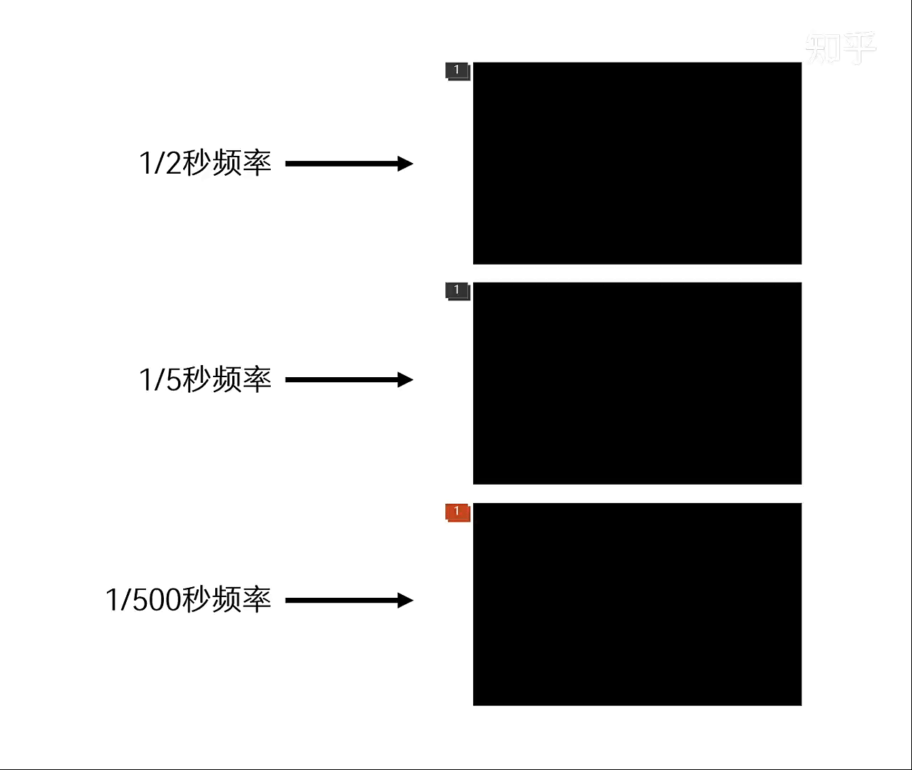

# 显示器的色深和FRC
说到显示器的色深，涉及到2个技术名词，分别是bit和FRC。

## Bit 色深
bit就是色深的单位，常见的有6bit，8bit，10bit。还有6抖8、8抖10这样的，抖的技术名词叫做FRC。

色深有什么用呢，就是不同色彩之间的过渡层级，越高越好，场景举例。

漆黑的夜晚中，开启一盏灯光，灯光发出的光与夜晚的黑之间的颜色交替。

又或者夕阳落山时，天空的白、黄、红各种颜色之间的交替。

色深参数越大，这种颜色过渡越细腻，反之，会出现色彩断层，就像下面这样。

8bit和10bit之间的差异绝对不是那些产品宣传图展现的那么明显。

在有的显示器产品上，常常看到1670万色，或者10.7亿色，这种参数表示的也是色深，为什么不用8bit或者10bit这样的单位呢？

首先，8bit可表现的色彩层级是256，也就是2的8次方，为什么是2的8次方，不是3的8次方或者其他数字的8次方呢？

在计算机内，一切都是以二进制进行识别和存储的，包括颜色代码，在《【万字长文】显示器知识科普扫盲以及避坑指南》一文中关于颜色代码有详细描述。

在计算机里，描述一种颜色，需要一个字节，也就是1B，1B=8bit。1bit=1位，而位的存储用的是二进制的形式二进制只有0和1，所以，每位（bit）都会有两种组合情况，而8位（bit）就会有2的8次方种组合，也就是256种，由此可以计算出来，8bit的色深，有2的8次方种颜色层级，256*256*256≈1670万。所以，1670万色，可以理解为8bit。

而10bit呢，就是2的10次方，1024*1024*1024≈10.7亿，所以10.7亿色就是10bit。

一般来说，如果只写10.7亿色，我们可以理解为就是8FRC10。凡是没有标注原生的，都可以理解为FRC技术。

为什么2的8次方和2的10次方要乘以3次呢？这个和显示器的物理结构有关系。

显示器是由N个像素点构成的，每个像素点都有红绿蓝三个RGB像素，每一个RGB都需要单独呈现不同颜色，所以，每个像素点的色深都要相乘。

这就是色深的参数以及其计算公式和原理。

## FRC(Frame Rate Control)技术

用PPT模拟的8FRC10的技术原理，中间的颜色代码是200,100,100。如果是原生10bit就会直接用这个颜色代码显示。

而8FRC10，也就是第一个和第三个色块，颜色代码分别是240,130,130和160,70,70。在两个不同的颜色之间来回切换，通过控制切换的时间和频率让眼睛误以为看到的就是200,100,100的颜色。

当然，实际上FRC的颜色代码区间跨度没这么大，闪烁也没这么厉害，要平滑的多。

FRC的过程中，背光一直是处于开启状态，和PWM频繁开启、关闭背光不一样，不会给眼睛带来伤害。下面视频时我用PPT模拟的PWM调光。

因为FRC插帧会来回切换相近的颜色，会导致画面出现细微的静态噪点。不过这种影响只要不是和原生的摆在一起对比，单独的使用肉眼很难察觉出来。

FRC插帧技术很成熟了，成本也很低，市面上6000以下的专业显示器产品，标注10bit的，大部分都是使用了FRC技术。
