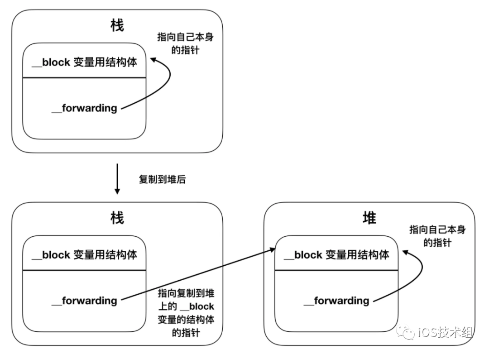

# Block 使用及原理

# 代码规范
```objc
// 定义一个 Block
typedef returnType (^BlockName)(parameterA, parameterB, ...);

eg: typedef void (^RequestResult)(BOOL result);

// 实例
^{
    NSLog(@"This is a block");
 }
```

# 本质
Block 本质上是一个 Objective-C 的对象，它内部也有一个 isa 指针，它是一个封装了函数及函数调用环境的 Objective-C 对象，可以添加到 `NSArray` 及 `NSDictionary` 等集合中，它是基于 C 语言及运行时特性，有点类似标准的 C 函数。但除了可执行代码以外，另外包含了变量同堆或栈的自动绑定。

# 常用介绍
## Block 的类型：
### 1. NSGlobalBlock
```objc
void (^exampleBlock)(void) = ^{
    // block
};
NSLog(@"exampleBlock is: %@",[exampleBlock class]);
```
打印日志：exampleBlock is: __NSGlobalBlock__
如果一个 block 没有访问外部局部变量，或者访问的是全局变量，或者静态局部变量，此时的 block 就是一个全局 block ，并且数据存储在全局区。

### 2. NSStackBlock
```objc
int temp = 100;
void (^exampleBlock)(void) = ^{
    // block
    NSLog(@"exampleBlock is: %d", temp);
};

NSLog(@"exampleBlock is: %@",[exampleBlock class]);
```
打印日志：exampleBlock is: __NSMallocBlock__？？？不是说好的 __NSStackBlock__ 的吗？为什么打印的是__NSMallocBlock__ 呢？这里是因为我们使用了 ARC ，Xcode 默认帮我们做了很多事情。
我们可以去 Build Settings 里面，找到 Objective-C Automatic Reference Counting ，并将其设置为 No ，然后再 Run 一次代码。你会看到打印日志是：exampleBlock is: __NSStackBlock__
如果 block 访问了外部局部变量，此时的 block 就是一个栈 block ，并且存储在栈区。由于栈区的释放是由系统控制，因此栈中的代码在作用域结束之后内存就会销毁，如果此时再调用 block 就会发生问题，( 注： 此代码运行在 MRC 下)如：
```objc
void (^simpleBlock)(void);
void callFunc() {
    int age = 10;
    simpleBlock = ^{
        NSLog(@"simpleBlock-----%d", age);
    };
}

int main(int argc, char * argv[]) {
    NSString * appDelegateClassName;
    @autoreleasepool {
        callFunc();
        simpleBlock();
        // Setup code that might create autoreleased objects goes here.
        appDelegateClassName = NSStringFromClass([AppDelegate class]);
    }
    return 0;
}
```
打印日志：simpleBlock--------41044160

### 3. NSMallocBlock
当一个 __NSStackBlock__ 类型 block 做 copy 操作后，就会将这个 block 从栈上复制到堆上，而堆上的这个 block 类型就是 __NSMallocBlock__ 类型。在 ARC 环境下，编译器会根据情况，自动将 block 从栈上 copy 到堆上。具体会进行 copy 的情况有如下 4 种：
block 作为函数的返回值时；
block 赋值给 __strong 指针，或者赋值给 block 类型的成员变量时；
block 作为 Cocoa API 中方法名含有 usingBlock 的方法参数时；
block 作为 GCD API 的方法参数时；

## __block 的作用

简单来说，__block 作用是允许 block 内部访问和修改外部变量，在 ARC 环境下还可以用来防止循环引用；
```objc
__block int age = 10;
void (^exampleBlock)(void) = ^{
    // block
    NSLog(@"1.age is: %d", age);
    age = 16;
    NSLog(@"2.age is: %d", age);
};
exampleBlock();
NSLog(@"3.age is: %d", age);
```
__block 主要用来解决 block 内部无法修改 auto 变量值的问题，为什么加上 __block 修饰之后，auto 变量值就能修改了呢？
这是因为，加上 __block 修饰之后，编译器会将 __block 变量包装成一个结构体 __Block_byref_age_0 ，结构体内部 *__forwarding 是指向自身的指针，并且结构体内部还存储着外部 auto 变量。
```objc
struct __Block_byref_val_0 {
    void *__isa; // isa指针
    __Block_byref_val_0 *__forwarding; 
    int __flags;
    int __size; // Block结构体大小
    int age; // 捕获到的变量
}
```


从上图可以看到，如果 block 是在栈上，那么这个 __forwarding 指针就是指向它自己，当这个 block 从栈上复制到堆上后，栈上的 __forwarding 指针指向的是复制到堆上的 __block 结构体。堆上的 __block 结构体中的 __forwarding 指向的还是它自己，即 age->__forwarding 获取到堆上的 __block 结构体，age->__forwarding->age 会把堆上的 age 赋值为 16 。因此不管是栈上还是堆上的 __block 结构体，最终使用到的都是堆上的 __block 结构体里面的数据。