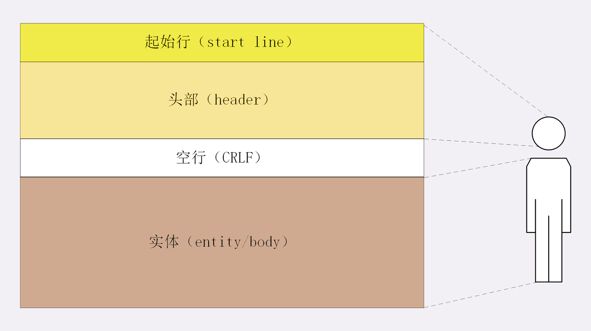
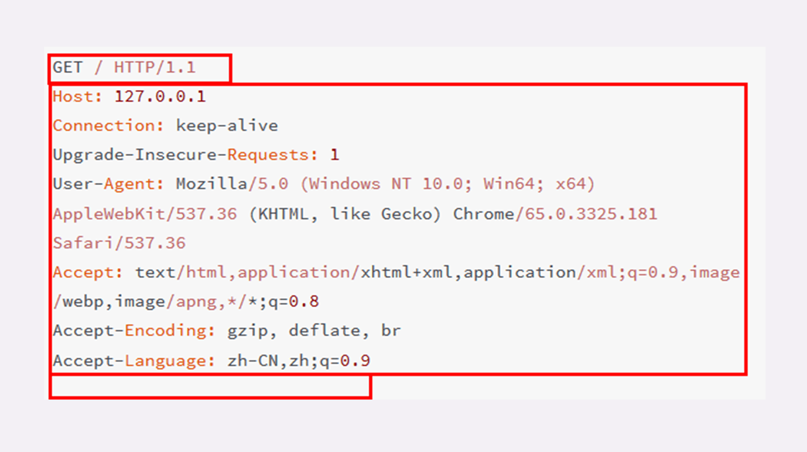
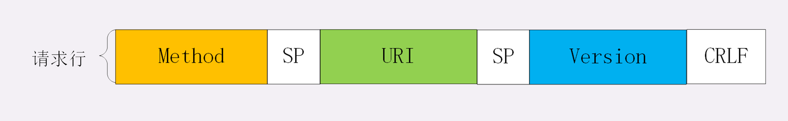
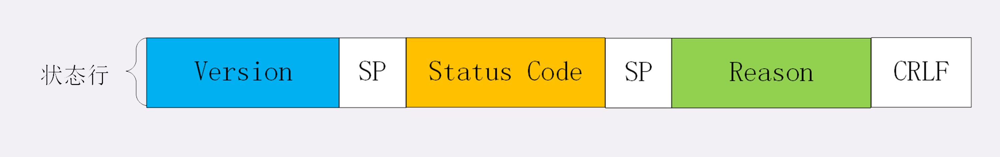
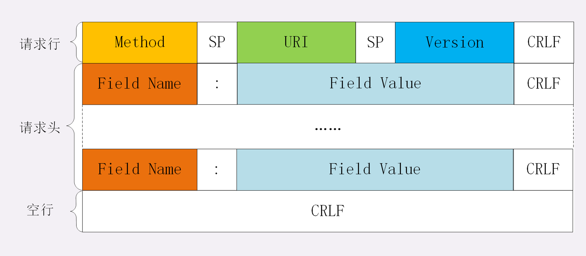
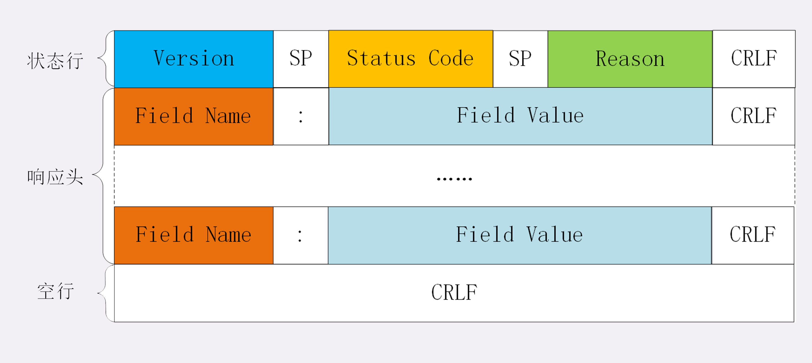

## 报文结构
## 请求报文和响应报文的结构基本相同：
1. 起始行（start line）：描述请求或响应的基本信息；
2. 头部字段集合（header）：使用 key-value 形式更详细地说明报文；
3. 消息正文（entity）：实际传输的数据，它不一定是纯文本，可以是图片、视频等二进制数据。

### 请求行
请求行由三部分构成：
1. 请求方法：是一个动词，如 GET/POST，表示对资源的操作；
2. 请求目标：通常是一个 URI，标记了请求方法要操作的资源；
3. 版本号：表示报文使用的 HTTP 协议版本。

这三个部分通常使用空格（space）来分隔，最后要用 CRLF 换行表示结束。

“GET”是请求方法，“/”是请求目标，“HTTP/1.1”是版本号，把这三部分连起来，意思就是“服务器你好，我想获取网站根目录下的默认文件，我用的协议版本号是 1.1，请不要用 1.0 或者 2.0 回复我。”

### 状态行
响应报文里的起始行，在这里它不叫“响应行”，而是叫“状态行”（status line），意思是服务器响应的状态。
状态行由三部分构成：
1. 版本号：表示报文使用的 HTTP 协议版本；
2. 状态码：一个三位数，用代码的形式表示处理的结果，比如 200 是成功，500 是服务器错误；
3. 原因：作为数字状态码补充，是更详细的解释文字，帮助人理解原因。

### 头部字段
请求行或状态行再加上头部字段集合就构成了 HTTP 报文里完整的请求头或响应头，请求头和响应头的结构是基本一样的，唯一的区别是起始行。

头部字段是 key-value 的形式，key 和 value 之间用“:”分隔，最后用 CRLF 换行表示字段结束。头字段需要注意下面几点：
1. 字段名不区分大小写，例如“Host”也可以写成“host”，但首字母大写的可读性更好；
2. 字段名里不允许出现空格，可以使用连字符“-”，但不能使用下划线“_”。例如，“test-name”是合法的字段名，而“test name”“test_name”是不正确的字段名；
3. 字段名后面必须紧接着“:”，不能有空格，而“:”后的字段值前可以有多个空格；
4. 字段的顺序是没有意义的，可以任意排列不影响语义；
5. 字段原则上不能重复，除非这个字段本身的语义允许，例如 Set-Cookie。

### 常用头字段
HTTP 协议规定了非常多的头部字段，实现各种各样的功能，但基本上可以分为四大类：
1. 通用字段：在请求头和响应头里都可以出现；
2. 请求字段：仅能出现在请求头里，进一步说明请求信息或者额外的附加条件；
3. 响应字段：仅能出现在响应头里，补充说明响应报文的信息；
4. 实体字段：它实际上属于通用字段，但专门描述 body 的额外信息。
